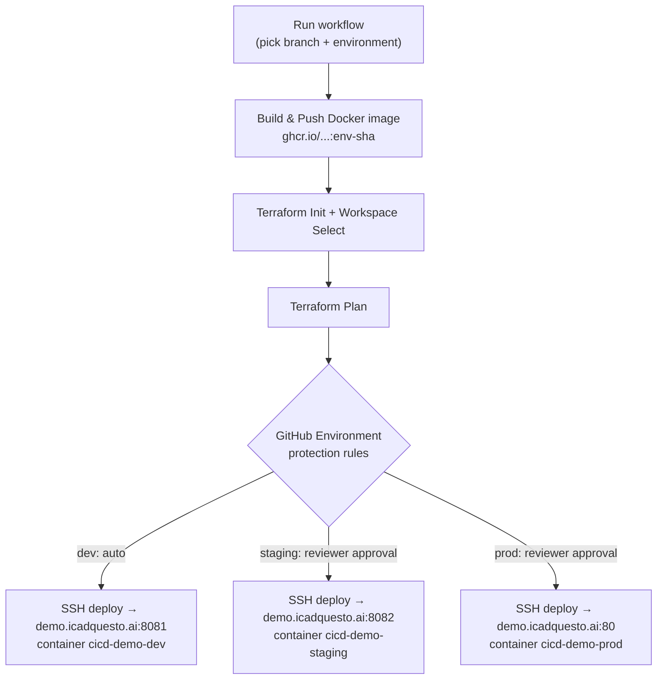

# cicd-demo

A "Coming Soon" static site deployed through a GitHub Actions pipeline that
builds a Docker image and deploys it, per environment, to a single shared
server (`demo.icadquesto.ai`) over SSH.

## Repo structure

```
cicd-demo/
├── .github/
│   └── workflows/
│       └── deploy.yml          # Build → Plan → Apply pipeline
├── environments/
│   ├── dev/
│   │   └── terraform.tfvars    # host_port 8081
│   ├── staging/
│   │   └── terraform.tfvars    # host_port 8082
│   └── prod/
│       └── terraform.tfvars    # host_port 80
├── terraform/
│   ├── providers.tf             # Backend + provider config (local for now)
│   ├── variables.tf             # environment, ssh_*, host_port, image_tag
│   ├── main.tf                  # SSH + docker run deploy resource
│   └── outputs.tf
├── Dockerfile                   # nginx serving index.html
├── .dockerignore
├── index.html                   # Coming-soon landing page
└── README.md
```

## Pipeline flow

Trigger the workflow manually from the **Actions** tab → *CI/CD Pipeline* →
**Run workflow**. GitHub's own run dialog is where you pick the **branch**
(via "Use workflow from") and the **environment** (via the `environment`
input dropdown) before it runs.



## Environment-wise deploys, one server

All three environments deploy to the **same host** (`demo.icadquesto.ai`),
each as its own Docker container so they don't collide:

| Environment | Container name        | Host port |
|-------------|------------------------|-----------|
| dev         | `cicd-demo-dev`        | 8081      |
| staging     | `cicd-demo-staging`    | 8082      |
| prod        | `cicd-demo-prod`       | 80        |

Each environment maps to:
- a **Terraform workspace** (`dev`, `staging`, `prod`) → isolated state
- a **tfvars file** under `environments/<env>/terraform.tfvars` (host,
  user, port, host_port)
- a **GitHub Environment** of the same name → configure required reviewers
  and the `SSH_PRIVATE_KEY` secret per environment in
  *Settings → Environments*. This is what gates `staging`/`prod` behind
  manual approval while letting `dev` run straight through, and is where
  the SSH private key for `demo.icadquesto.ai` gets stored.

## Setup checklist

1. In **Settings → Environments**, create `dev`, `staging`, `prod`.
   Add required reviewers to `staging` and `prod` for approval gates.
2. On each of those three environments, add secret `SSH_PRIVATE_KEY`
   containing the private key that matches a public key already
   authorized (`~/.ssh/authorized_keys`) for the SSH user on
   `demo.icadquesto.ai`.
3. Edit `environments/<env>/terraform.tfvars` and replace `ssh_user`
   (currently `REPLACE_ME`) with the real SSH username on that server.
4. Make sure Docker is running on `demo.icadquesto.ai` and the deploy
   user can run `docker` commands without `sudo` (add them to the
   `docker` group), and that the GHCR image is pullable from that server
   — either make the package public, or add a `docker login` line to
   `terraform/main.tf`'s `remote-exec` block if it's private.
5. Push this repo to `origin` (already set to
   `https://github.com/chandnitin333/cicd-demo.git`).
6. Run the workflow from the Actions tab, choosing the branch and
   environment. Each Terraform output includes the reachable `url`
   (e.g. `http://demo.icadquesto.ai:8081` for dev).

## Notes / next steps

- Put an nginx/Caddy reverse proxy in front on the server if you'd rather
  reach each environment through a subdomain than a raw port.
- Docker images are pushed to GitHub Container Registry (`ghcr.io`) using
  the built-in `GITHUB_TOKEN` — no extra secrets needed for that part.
