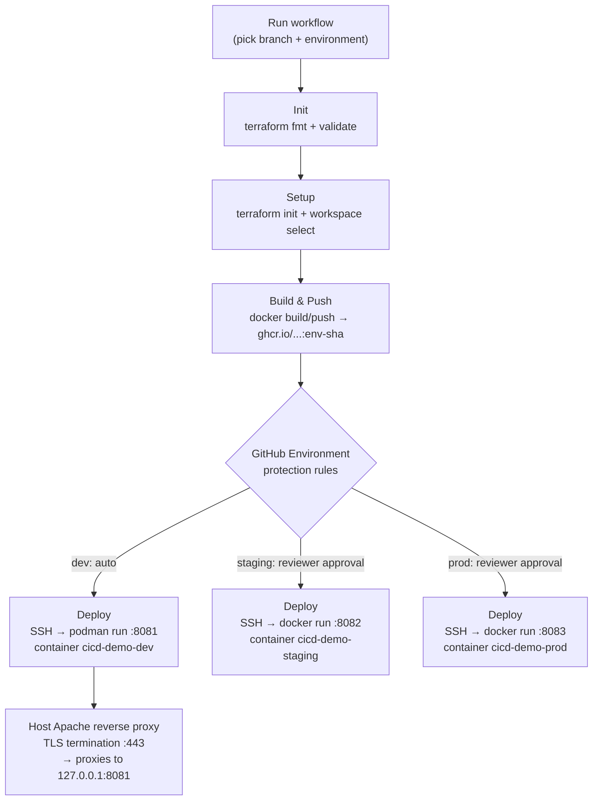

# cicd-demo

A "Coming Soon" static site deployed through a GitHub Actions pipeline that
builds a Docker image and deploys it, per environment, to a single shared
server (`demo.icadquesto.ai`) over SSH.

## Repo structure

```
cicd-demo/
├── .github/
│   └── workflows/
│       └── deploy.yml          # Init → Setup → Build & Push → Deploy
├── environments/
│   ├── dev/
│   │   └── terraform.tfvars    # host_port 8081
│   ├── staging/
│   │   └── terraform.tfvars    # host_port 8082
│   └── prod/
│       └── terraform.tfvars    # host_port 8083
├── terraform/
│   ├── providers.tf             # Backend + provider config (local for now)
│   ├── variables.tf             # environment, ssh_*, host_port, image_tag
│   ├── main.tf                  # SSH + docker run deploy resource
│   └── outputs.tf
├── Dockerfile                   # Apache (httpd) serving index.html
├── .dockerignore
├── index.html                   # Coming-soon landing page
└── README.md
```

## Pipeline flow

Trigger the workflow manually from the **Actions** tab → *CI/CD Pipeline* →
**Run workflow**. GitHub's own run dialog is where you pick the **branch**
(via "Use workflow from") and the **environment** (via the `environment`
input dropdown) before it runs. The job graph is a straight chain of four
stages:



`dev` is the only environment migrated to Podman + a TLS-terminating Apache
reverse proxy so far (see [TLS / Podman setup (dev)](#tls--podman-setup-dev)
below); `staging` and `prod` are unchanged for now.

| Job | What it does |
|-----|---------------|
| **Init** | Checkout, `terraform fmt -check`, `terraform validate` — fast sanity gate |
| **Setup** | `terraform init` + `terraform workspace select -or-create <env>` |
| **Build & Push** | Docker build, tag with `<env>-<sha>`, push to GHCR |
| **Deploy** | `terraform plan` + `apply` — SSHes into the server and runs the container (gated by the GitHub Environment's approval rules) |

## Environment-wise deploys, one server

All three environments deploy to the **same host** (`demo.icadquesto.ai`),
each as its own Docker container so they don't collide:

| Environment | Container name        | Host port | Runtime | Public URL |
|-------------|------------------------|-----------|---------|------------|
| dev         | `cicd-demo-dev`        | 8081      | Podman  | `https://demo.icadquesto.ai/` (via host Apache reverse proxy) |
| staging     | `cicd-demo-staging`    | 8082      | Docker  | `http://demo.icadquesto.ai:8082` |
| prod        | `cicd-demo-prod`       | 8083      | Docker  | `http://demo.icadquesto.ai:8083` |

Each environment maps to:
- a **Terraform workspace** (`dev`, `staging`, `prod`) → isolated state
- a **tfvars file** under `environments/<env>/terraform.tfvars` (host,
  user, port, host_port)
- a **GitHub Environment** of the same name → configure required reviewers
  and the `SSH_PRIVATE_KEY` secret per environment in
  *Settings → Environments*. This is what gates `staging`/`prod` behind
  manual approval while letting `dev` run straight through, and is where
  the SSH private key for `demo.icadquesto.ai` gets stored.

## Setup checklist

1. In **Settings → Environments**, create `dev`, `staging`, `prod`.
   Add required reviewers to `staging` and `prod` for approval gates.
2. On each of those three environments, add secret `SSH_PRIVATE_KEY`
   containing the private key that matches a public key already
   authorized (`~/.ssh/authorized_keys`) for the SSH user on
   `demo.icadquesto.ai`.
3. Confirm the `ssh_user` in each `environments/<env>/terraform.tfvars`
   (currently `github-deploy`) matches a real SSH user on that server.
4. Make sure the right container runtime is running on `demo.icadquesto.ai`
   for each environment (Podman for `dev`, Docker for `staging`/`prod` — see
   [TLS / Podman setup (dev)](#tls--podman-setup-dev)) and the deploy user
   can run its commands without `sudo` (added to the `docker`/`podman`
   group as needed), and that the GHCR image is pullable from that server
   — either make the package public, or add a `<runtime> login` line to
   `terraform/main.tf`'s `remote-exec` block if it's private.
5. Push this repo to `origin` (already set to
   `https://github.com/chandnitin333/cicd-demo.git`).
6. Run the workflow from the Actions tab, choosing the branch and
   environment. Each Terraform output includes the reachable `url`
   (e.g. `https://demo.icadquesto.ai/` for dev,
   `http://demo.icadquesto.ai:8082` for staging).

## TLS / Podman setup (dev)

`dev` is fronted by a **host-level** Apache reverse proxy that terminates
TLS on `:443` and forwards to the container on `127.0.0.1:8081`; the
container itself just serves plain HTTP on port 80 internally (mapped to
8081), same as before. This is a one-time setup on `demo.icadquesto.ai`
(not something Terraform/CI does on every deploy) — run once, before the
first `dev` deploy through the pipeline:

```bash
# 1. Install podman (replaces docker for the dev container) and the host
#    Apache + TLS tooling. Adjust for your distro's package manager if not
#    dnf/RHEL-family.
sudo dnf install -y podman httpd mod_ssl certbot python3-certbot-apache

# 2. Open HTTPS on the firewall (8081 should already be open per
#    `firewall-cmd --list-ports`; keep it open, the proxy talks to it
#    locally without going through the firewall's public zone rules
#    mattering for 127.0.0.1 traffic).
sudo firewall-cmd --add-service=https --permanent
sudo firewall-cmd --add-service=http --permanent   # needed for the certbot HTTP-01 challenge
sudo firewall-cmd --reload

# 3. Point Apache at the backend container before requesting the cert —
#    certbot's --apache plugin edits this vhost in place to add the TLS
#    block, so create the plain-HTTP version first.
sudo tee /etc/httpd/conf.d/demo.icadquesto.ai.conf <<'EOF'
<VirtualHost *:80>
    ServerName demo.icadquesto.ai
    ProxyPreserveHost On
    ProxyPass / http://127.0.0.1:8081/
    ProxyPassReverse / http://127.0.0.1:8081/
</VirtualHost>
EOF
sudo sed -i '/^#LoadModule proxy_module/s/^#//; /^#LoadModule proxy_http_module/s/^#//' /etc/httpd/conf.modules.d/00-proxy.conf
sudo systemctl enable --now httpd

# 4. SELinux (RHEL/CentOS/Fedora only — skip if disabled): allow Apache to
#    make outbound connections to the container's port.
sudo setsebool -P httpd_can_network_connect 1

# 5. Issue the cert. This rewrites the vhost above to add the :443
#    <VirtualHost> block and redirect :80 → :443.
sudo certbot --apache -d demo.icadquesto.ai --redirect -m <your-email> --agree-tos

# 6. Verify
curl -I https://demo.icadquesto.ai/
```

After this one-time setup, every `dev` deploy through the pipeline just
updates the container behind the proxy — the proxy config doesn't change
per deploy. Certbot installs a renewal timer/cron job automatically; check
it with `sudo certbot renew --dry-run`.

## Notes / next steps

- Put an nginx/Caddy reverse proxy in front of `staging`/`prod` too if you
  want them off raw ports, following the same pattern as the dev Apache
  proxy above.
- Docker images are pushed to GitHub Container Registry (`ghcr.io`) using
  the built-in `GITHUB_TOKEN` — no extra secrets needed for that part.
