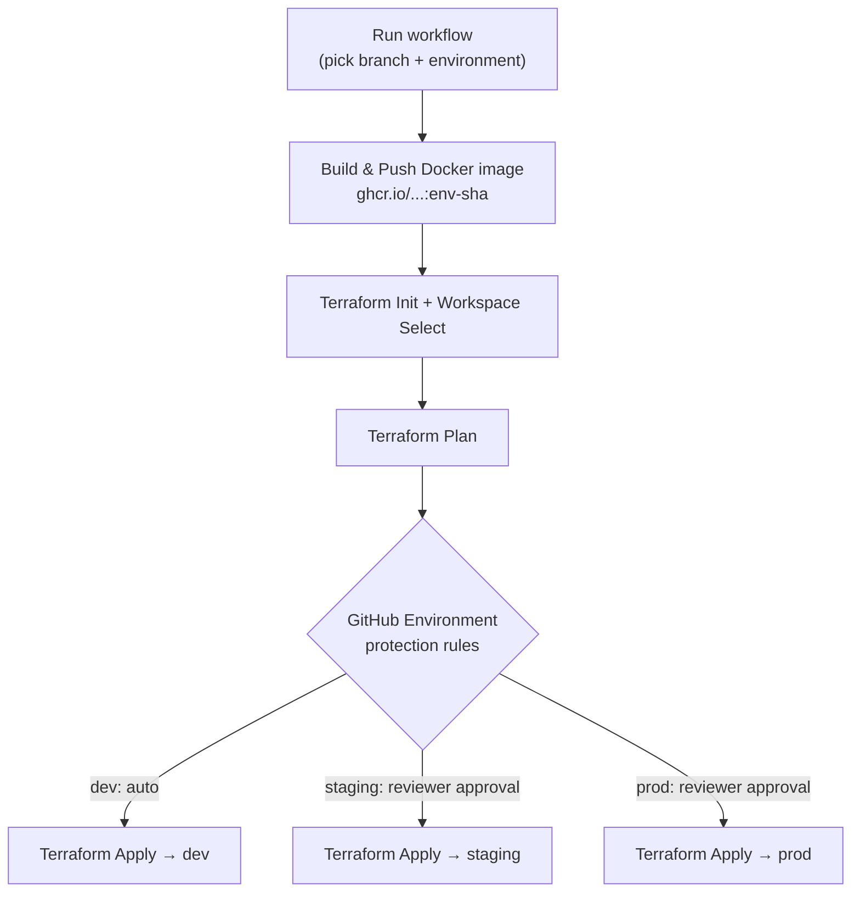

# cicd-demo

A "Coming Soon" static site deployed through a GitHub Actions pipeline that
builds a Docker image and provisions it per environment with Terraform.

## Repo structure

```
cicd-demo/
├── .github/
│   └── workflows/
│       └── deploy.yml          # Build → Plan → Apply pipeline
├── environments/
│   ├── dev/
│   │   └── terraform.tfvars
│   ├── staging/
│   │   └── terraform.tfvars
│   └── prod/
│       └── terraform.tfvars
├── terraform/
│   ├── providers.tf             # Backend + provider config (local for now)
│   ├── variables.tf             # environment, app_name, image_tag
│   ├── main.tf                  # Deploy resource (placeholder, swap per cloud)
│   └── outputs.tf
├── Dockerfile                   # nginx serving index.html
├── .dockerignore
├── index.html                   # Coming-soon landing page
└── README.md
```

## Pipeline flow

Trigger the workflow manually from the **Actions** tab → *CI/CD Pipeline* →
**Run workflow**. GitHub's own run dialog is where you pick the **branch**
(via "Use workflow from") and the **environment** (via the `environment`
input dropdown) before it runs.



## Environment-wise deploys

Each environment maps to:
- a **Terraform workspace** (`dev`, `staging`, `prod`) → isolated state
- a **tfvars file** under `environments/<env>/terraform.tfvars`
- a **GitHub Environment** of the same name → configure required reviewers
  and secrets per environment in *Settings → Environments*. This is what
  gates `staging`/`prod` behind manual approval while letting `dev` run
  straight through.

## Setup checklist

1. In **Settings → Environments**, create `dev`, `staging`, `prod`.
   Add required reviewers to `staging` and `prod` for approval gates.
2. Push this repo to `origin` (already set to
   `https://github.com/chandnitin333/cicd-demo.git`).
3. Run the workflow from the Actions tab, choosing the branch and
   environment.

## Notes / next steps

- `terraform/main.tf` currently has a placeholder `null_resource` — swap it
  for a real resource (ECS/App Runner, Container Apps, Cloud Run, etc.) once
  a cloud provider is chosen, and update `terraform/providers.tf` with a
  remote backend (S3, azurerm, or GCS) instead of the local one.
- Docker images are pushed to GitHub Container Registry (`ghcr.io`) using the
  built-in `GITHUB_TOKEN` — no extra secrets needed for that part.
